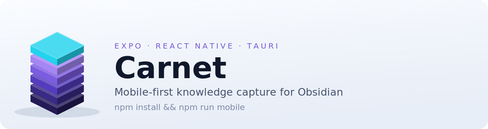

<!-- glowup:hero start -->
<div align="center">
<h1>
  <picture>
    <source media="(prefers-color-scheme: dark)" srcset="docs/assets/banner.svg">
    
  </picture>
</h1>

[](https://github.com/Entrevoix/carnet/actions/workflows/ci.yml)
[](https://www.gnu.org/licenses/agpl-3.0)


</div>
<!-- glowup:hero end -->

## Architecture

```
ANDROID MOBILE (Expo + RN)                  WORKSTATION
┌───────────────────────────────┐          ┌──────────────────────────┐
│ Capture screens               │          │                          │
│  ├ Idea (text)                │          │  ~/Obsidian/Carnet/      │
│  ├ Journal (voice→text)       │  HTTPS   │     Ideas/{slug}.md      │
│  ├ Person (camera→OCR)        │ ───────► │     Journal/YYYY-MM-DD.md│
│  └ Photo (camera→vision)      │          │     People/F-L.md        │
│         │                     │          │     Photos/{slug}.jpg    │
│         ▼                     │          │            ▲             │
│  lib/omniroute.ts (LLM)       │          │            │             │
│  lib/prompts.ts               │          │     Syncthing daemon     │
│  lib/writer.ts (md to disk)   │          │            ▲             │
│  lib/queue.ts (offline)       │          │            │             │
│         │                     │          │            │             │
│         ▼                     │          │            │             │
│  Local folder ────────────────┼──────────┼─► carnet/ folder         │
│  /Documents/carnet/           │ Syncthing p2p                       │
│         │                     │                                     │
│         ▼                     │                                     │
│  Syncthing Android app        │                                     │
└───────────────────────────────┘          └──────────────────────────┘

   NO DAEMON. NO CUSTOM RUST. NO HMAC HANDSHAKE.
```

Four capture modes:

| Mode | Input | Output |
|------|-------|--------|
| `idea`    | text                        | `Ideas/{slug}.md` |
| `journal` | voice transcript (+ text)   | `Journal/{YYYY-MM-DD}.md` (appends to existing) |
| `person`  | OCR'd business card + text  | `People/{Firstname-Lastname}.md` |
| `photo`   | in-app camera (+ voice/text context) | `Photos/{slug}.jpg` + paired `Ideas/{slug}.md` (via OmniRoute vision) |

All four modes go through OmniRoute for LLM enrichment, then write directly to the local capture folder. Offline captures are queued on-device (AsyncStorage) and drained on reconnect. Photo capture shares the same vision pipeline used by the Android share-target (Share → carnet on an image).

Any note can optionally be pushed to a self-hosted **Karakeep** instance from its detail screen ("Send to Karakeep" → text bookmark + tags + image/file attachments). Export is opt-in and configured per device.

## Layout

```
carnet/
  apps/
    mobile/          Expo 54 + React Native + TypeScript
    desktop/         Tauri v2 stub (placeholder UI, fate deferred to v0.3)
  packages/
    shared/          @carnet/shared — note types + markdown helpers
  docs/
    sync-setup.md    Syncthing setup guide (Android + workstation)
```

## Prerequisites

- Node 20+
- npm 10+
- For mobile: Expo CLI and a physical Android device or emulator
- An **OmniRoute API key** (set in the app's Settings screen)
- **Syncthing** installed on both your Android device and workstation — see [docs/sync-setup.md](docs/sync-setup.md)

No daemon, no navetted, no Rust toolchain required for mobile development.

## Build

```bash
# Install once at root
npm install

# Build the shared package (types + markdown helpers)
npm run build:shared

# Run mobile in Expo
npm run mobile

# Type-check
npm -w @carnet/mobile run typecheck
npm -w @carnet/shared run typecheck
```

## Configuration

Open the **Settings** screen in the app and set:

| Setting | Description |
|---------|-------------|
| OmniRoute URL | Base URL of your OmniRoute instance (e.g. `https://llm.grepon.cc`) |
| OmniRoute API key | Your API key — stored in the OS secure keystore via `expo-secure-store` |
| Capture folder | Path to your Syncthing-watched folder on Android (e.g. `/storage/emulated/0/carnet`). Leave blank to use the app sandbox. |
| Karakeep URL | *(Optional)* Base URL of a self-hosted Karakeep, for per-note export (e.g. `https://keep.example.com`) |
| Karakeep API key | *(Optional)* Karakeep API key (Karakeep UI → User Settings → API Keys) — stored via `expo-secure-store` |

### Syncthing sync

See [docs/sync-setup.md](docs/sync-setup.md) for step-by-step instructions to pair the Android capture folder with `~/Obsidian/Carnet/` on your workstation.

## Desktop app

`apps/desktop` is a Tauri v2 placeholder stub. Its fate (rebuild or deprecate) will be decided after v0.2 mobile dogfooding. See TODO.md.

## License

AGPL-3.0-only
